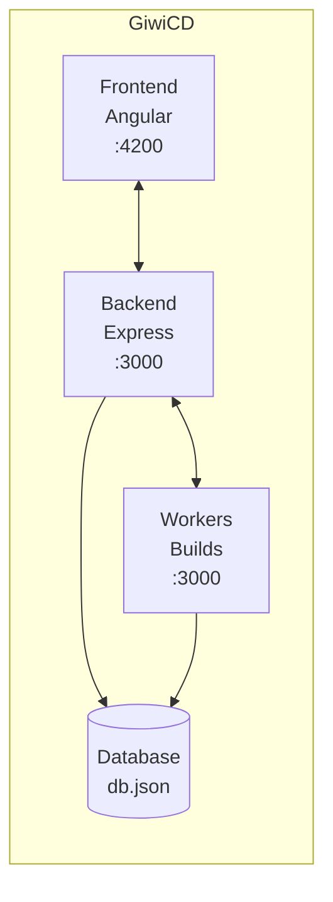
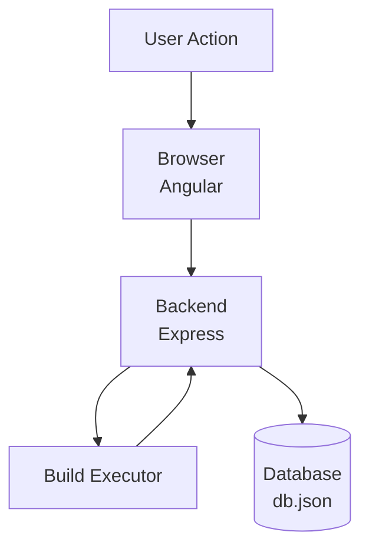
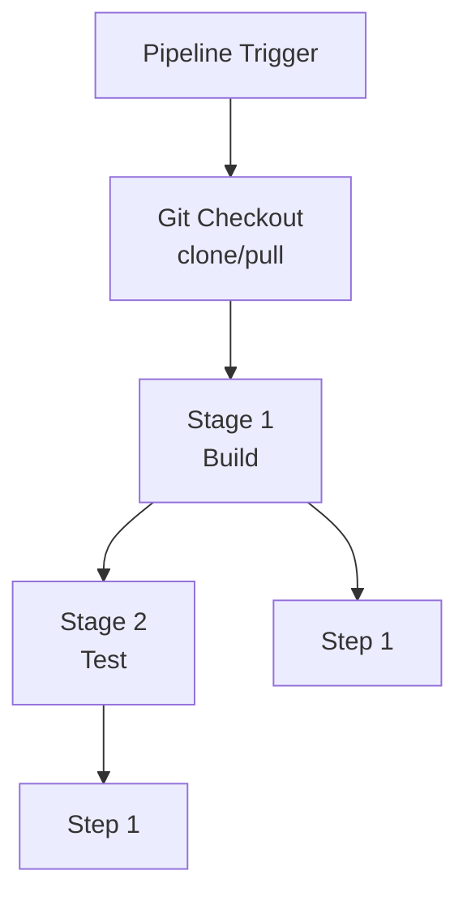

# GiwiCD Architecture

## System Overview



## Data Flow



## API Routes

```
/api
├── /version              - API version info
├── /health
│   ├── GET    /               - Full health check
│   ├── GET    /live           - Liveness probe
│   └── GET    /ready          - Readiness probe
│
├── /auth
│   ├── POST   /login          - User login
│   ├── POST   /register       - User registration
│   ├── GET    /me             - Get current user
│   ├── PUT    /me             - Update profile
│   └── PUT    /password       - Change password
│
├── /dashboard            - Dashboard statistics (optional auth)
│
├── /webhooks
│   └── /webhook/:id      - Trigger pipeline from git
│
├── /pipelines
│   ├── GET    /               - List pipelines (paginated)
│   ├── GET    /:id            - Get pipeline details
│   ├── POST   /               - Create pipeline
│   ├── POST   /import         - Import pipeline from JSON
│   ├── PUT    /:id            - Update pipeline
│   ├── DELETE /:id            - Delete pipeline
│   ├── POST  /:id/trigger    - Trigger build
│   ├── POST  /:id/toggle     - Enable/disable pipeline
│   ├── PATCH /:id/cancel     - Cancel running build
│   └── GET   /:id/builds     - Get pipeline builds (paginated)
│
├── /builds
│   ├── GET    /               - List builds (paginated)
│   ├── GET    /stats          - Build statistics
│   ├── GET    /:id            - Get build details
│   ├── GET    /:id/logs       - Get build logs
│   └── POST  /:id/cancel      - Cancel build
│
├── /credentials
│   ├── GET    /               - List credentials
│   ├── GET    /:id            - Get credential details
│   ├── POST   /               - Create credential
│   ├── PUT    /:id            - Update credential
│   ├── POST   /:id/test      - Test credential
│   └── DELETE /:id            - Delete credential
│
├── /polling
│   ├── POST   /check/:id      - Check pipeline for updates
│   └── POST   /check-all      - Check all pipelines
│
├── /admin (Admin only)
│   ├── GET    /users          - List users
│   ├── POST   /users          - Create user
│   ├── PUT    /users/:id      - Update user
│   ├── DELETE /users/:id      - Delete user
│   ├── GET    /settings       - Get settings
│   ├── PUT    /settings       - Update settings
│   ├── GET    /logs           - Get server logs
│   ├── DELETE /logs           - Clear logs
│   └── GET    /export         - Export all data as JSON
│
└── /webhooks
    ├── GET    /webhook/:id    - Trigger webhook manually
    └── POST   /webhook/:id    - Push event webhook (GitHub/GitLab)
```

## Build Pipeline Execution



## Database Schema

```
SQLite Tables:

users
├── id          (TEXT - UUID)
├── email       (TEXT - UNIQUE)
├── username    (TEXT)
├── password    (TEXT - bcrypt hash)
├── role        (TEXT - admin/contributor)
├── createdAt   (TEXT - ISO timestamp)
└── updatedAt   (TEXT - ISO timestamp)

pipelines
├── id              (TEXT - UUID)
├── userId          (TEXT)
├── name            (TEXT)
├── description     (TEXT)
├── repositoryUrl   (TEXT)
├── credentialId    (TEXT)
├── branch           (TEXT)
├── triggers        (TEXT - JSON)
├── stages          (TEXT - JSON)
├── environment     (TEXT - JSON)
├── artifactPaths   (TEXT - JSON)
├── enabled         (INTEGER - boolean)
├── status          (TEXT)
├── lastBuildAt     (TEXT)
├── lastBuildStatus  (TEXT)
├── lastCommit       (TEXT)
├── pollingInterval  (INTEGER)
├── keepBuilds      (INTEGER)
├── createdAt        (TEXT)
└── updatedAt        (TEXT)

builds
├── id           (TEXT - UUID)
├── pipelineId   (TEXT)
├── pipelineName (TEXT)
├── number       (INTEGER)
├── status       (TEXT)
├── branch       (TEXT)
├── commit       (TEXT)
├── commitMessage (TEXT)
├── triggeredBy  (TEXT)
├── startedAt    (TEXT)
├── finishedAt   (TEXT)
├── duration     (INTEGER)
├── logs         (TEXT - JSON)
├── stages       (TEXT - JSON)
├── createdAt    (TEXT)
└── updatedAt    (TEXT)

credentials
├── id          (TEXT - UUID)
├── userId      (TEXT)
├── name        (TEXT)
├── type        (TEXT)
├── username    (TEXT)
├── password    (TEXT)
├── token       (TEXT)
├── privateKey  (TEXT)
├── passphrase  (TEXT)
├── description (TEXT)
├── provider    (TEXT)
├── createdAt   (TEXT)
└── updatedAt   (TEXT)

settings
├── key    (TEXT - PRIMARY KEY)
└── value  (TEXT - JSON)
```

## WebSocket Events

```
Server ─────────────────────────────► Client

build:log      - Log entry from build
build:stage    - Stage started/completed
build:step     - Step started/completed
build:complete - Build finished
build:cancelled - Build cancelled
```

## Technology Stack

```
┌─────────────────────────────────────────────────────────────────┐
│                        Frontend                                  │
├─────────────────────────────────────────────────────────────────┤
│  Angular 20 (Standalone Components)                            │
│  TypeScript                                                     │
│  Bootstrap 5                                                    │
│  Bootstrap Icons                                                │
│  SCSS + CSS Variables                                           │
└─────────────────────────────────────────────────────────────────┘

┌─────────────────────────────────────────────────────────────────┐
│                         Backend                                  │
├─────────────────────────────────────────────────────────────────┤
│  Node.js 18+                                                    │
│  Express.js                                                     │
│  TypeScript (strict mode)                                       │
│  SQLite (better-sqlite3)                                        │
│  JWT Auth (jsonwebtoken)                                        │
│  bcrypt                                                         │
│  WebSocket (ws)                                                 │
│  Git operations (child_process)                                   │
└─────────────────────────────────────────────────────────────────┘

┌─────────────────────────────────────────────────────────────────┐
│                        Middleware                                │
├─────────────────────────────────────────────────────────────────┤
│  auth.js          - JWT authentication + RBAC                   │
│  rateLimit.js     - Rate limiting                                │
│  csrf.js          - CSRF protection                             │
│  logger.js        - Structured JSON logging                     │
│  pagination.js    - API pagination                              │
│  asyncHandler.js  - Async error handling                        │
│  errorHandler.js  - Global error handling                       │
└─────────────────────────────────────────────────────────────────┘

┌─────────────────────────────────────────────────────────────────┐
│                         Services                                 │
├─────────────────────────────────────────────────────────────────┤
│  BuildExecutor      - Build orchestration & queue management    │
│  BuildRunner        - Build execution and lifecycle             │
│  BuildQueue         - FIFO queue with concurrency limit         │
│  CommandExecutor    - Shell command execution                  │
│  GitService         - Git clone/pull operations                 │
│  NotificationService - Telegram, Slack, Teams, Email          │
│  PollingService     - Git repository polling                   │
│  ScheduleService    - Cron-based build scheduling              │
│  WebSocketManager   - Real-time communication                  │
│  ArtifactStorage    - Build artifact storage                  │
│  stageWorker        - Stage/step execution worker              │
└─────────────────────────────────────────────────────────────────┘
```

## Features

### Pipeline Management
- Create, edit, delete pipelines
- Import/export pipelines as JSON
- Enable/disable pipelines
- Manual and webhook triggers

### Build Execution
- Parallel stage execution
- Step-by-step execution
- Real-time logs via WebSocket
- Build history and status

### Notifications
- Telegram, Slack, Teams, Email support
- Customizable messages with variables
- Per-pipeline notification configuration
- Credential-based authentication

### Security
- JWT authentication
- Role-based access (admin/contributor)
- Credential encryption
- Secure Git operations

### User Management
- User registration (optional)
- Role management
- Profile settings
